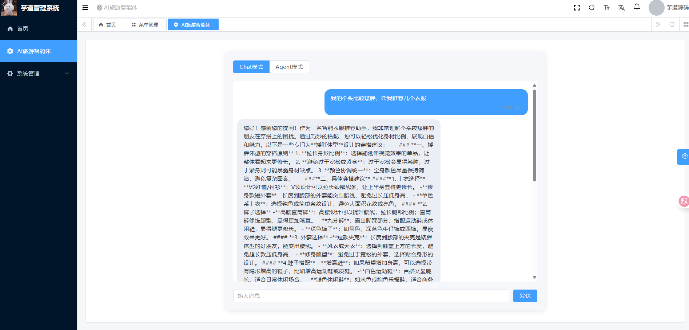

## 🫕项目介绍

### 介绍

本项目是一个基于Spring AI的智能AI穿衣助手，能帮助各种不同身材、不同身高和不同肤色解决穿衣打扮问题。本项目提供对话模式和Agent模式，最终对话结果通过sse流式输出。

- 对话模式：基于RAG检索增强生成技术、基于内存的会话记录、自定义Advisors来记录日志信息、自定义MCP服务来搜索穿衣图片。
- Agent智能体模式：通过仿照OpenManus的模板方法模式定义整体架构，通过自定义工具集合来增强Agent的能力，可以根据用户信息动态查询附近的服装店，从而提供合理的购衣技巧。

### 前台界面

[](https://github.com/ObjectKjq/meet-friends/blob/master/doc/Snipaste_2024-05-14_22-02-16.png)

## 🥗技术

- ruoyi-vue-pro
- JDK 17/21
- Spring Boot 3.2
- Spring AI
- Vue3
- TypeScript
- RAG知识库
- MCP模型上下文协议
- Tool Calling工具调用
- SSE 异步推送

## 🍘快速启动

1. java后端新增application-local.yml配置文件

```yml
spring:
  ai:
    dashscope:
      api-key: 自己的api-key
      chat:
        options:
          model: qwen-plus
    mcp: # mcp配置
      client:
        sse:
          connections:
            url: http://localhost:8127
  autoconfigure:
    exclude:
      - org.springframework.boot.autoconfigure.quartz.QuartzAutoConfiguration # 默认 local 环境，不开启 Quartz 的自动配置
      - de.codecentric.boot.admin.server.config.AdminServerAutoConfiguration # 禁用 Spring Boot Admin 的 Server 的自动配置
      - de.codecentric.boot.admin.server.ui.config.AdminServerUiAutoConfiguration # 禁用 Spring Boot Admin 的 Server UI 的自动配置
      - de.codecentric.boot.admin.client.config.SpringBootAdminClientAutoConfiguration # 禁用 Spring Boot Admin 的 Client 的自动配置
      - org.springframework.ai.autoconfigure.vectorstore.qdrant.QdrantVectorStoreAutoConfiguration # 禁用 AI 模块的 Qdrant，手动创建
      - org.springframework.ai.autoconfigure.vectorstore.milvus.MilvusVectorStoreAutoConfiguration # 禁用 AI 模块的 Milvus，手动创建
  # 数据源配置项
  datasource:
    druid: # Druid 【监控】相关的全局配置
      web-stat-filter:
        enabled: true
      stat-view-servlet:
        enabled: true
        allow: # 设置白名单，不填则允许所有访问
        url-pattern: /druid/*
        login-username: # 控制台管理用户名和密码
        login-password:
      filter:
        stat:
          enabled: true
          log-slow-sql: true # 慢 SQL 记录
          slow-sql-millis: 100
          merge-sql: true
        wall:
          config:
            multi-statement-allow: true
    dynamic: # 多数据源配置
      druid: # Druid 【连接池】相关的全局配置
        initial-size: 1 # 初始连接数
        min-idle: 1 # 最小连接池数量
        max-active: 20 # 最大连接池数量
        max-wait: 600000 # 配置获取连接等待超时的时间，单位：毫秒
        time-between-eviction-runs-millis: 60000 # 配置间隔多久才进行一次检测，检测需要关闭的空闲连接，单位：毫秒
        min-evictable-idle-time-millis: 300000 # 配置一个连接在池中最小生存的时间，单位：毫秒
        max-evictable-idle-time-millis: 900000 # 配置一个连接在池中最大生存的时间，单位：毫秒
        validation-query: SELECT 1 # 配置检测连接是否有效
        test-while-idle: true
        test-on-borrow: false
        test-on-return: false
      primary: master
      datasource:
        master:
          url: jdbc:mysql://127.0.0.1:3306/ruoyi-vue-pro?useSSL=false&serverTimezone=Asia/Shanghai&allowPublicKeyRetrieval=true&nullCatalogMeansCurrent=true&rewriteBatchedStatements=true
          username: root
          password: kjq
```

2. 前端项目启动

```sh
# 安装 pnpm，提升依赖的安装速度
npm config set registry https://registry.npmmirror.com
npm install -g pnpm
# 安装依赖
pnpm install
# 启动服务
npm run dev
```

